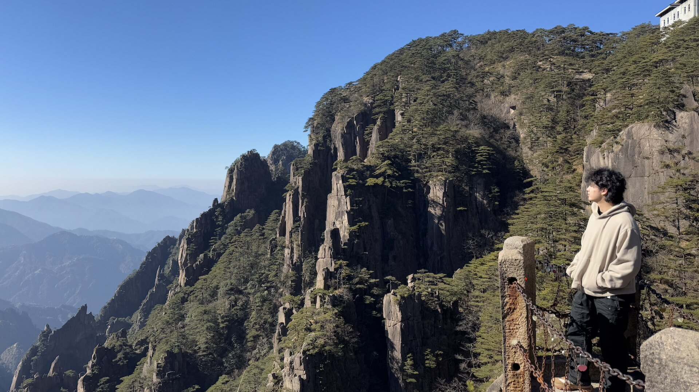
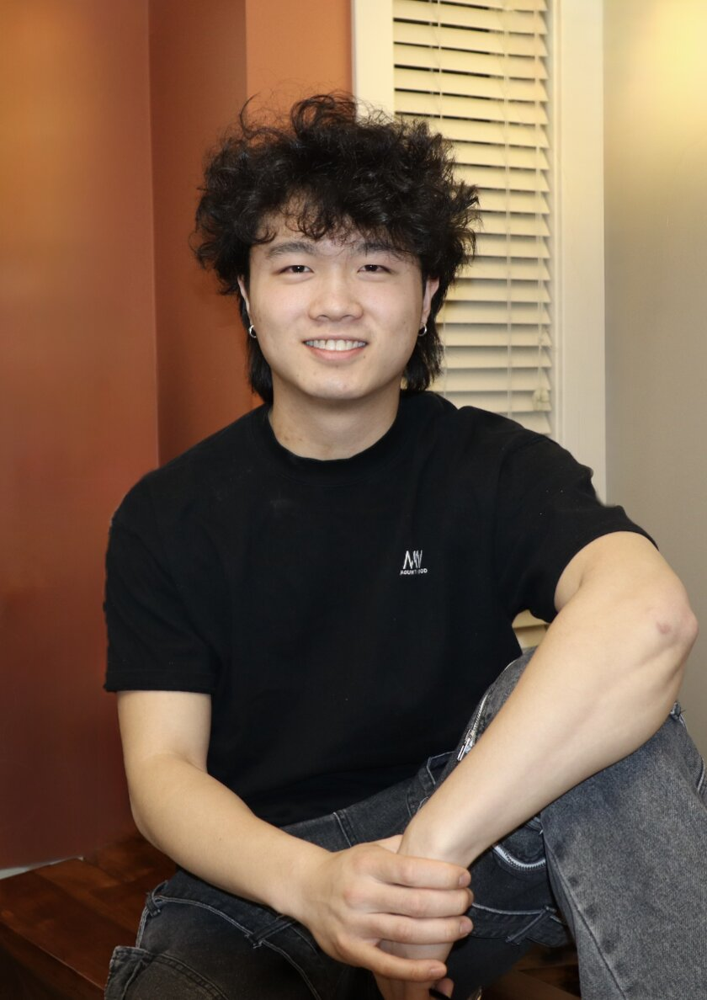
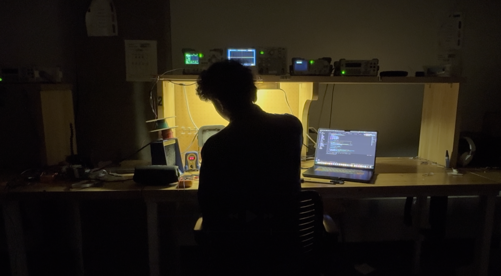

  <a href="/">
    

      
      

      

        H
        E
        L
        L
        O
      

      
↓ scroll to see what I've been working on ↓

    

  </a>

<!-- FEATURED PROJECTS CAROUSEL - REBUILT FROM SCRATCH -->

  <!-- Featured text on left side - properly vertical -->
  

    F
    E
    A
    T
    U
    R
    E
    D
  

  
  <!-- Featured text on right side - properly vertical -->
  

    F
    E
    A
    T
    U
    R
    E
    D
  

  
  <!-- Data attribute container for JavaScript -->
  

    
    
      

      

    
  

  
  <!-- Carousel container -->
  

    
    
    
    <!-- Show appropriate placeholder message if no featured projects -->
    
      

        
No featured projects to display. Set featured: true in project front matter.

      

    
      <!-- LEFT ITEM: Only show if we have at least 2 featured projects -->
      
        
        

          

            
            

              
              

{{ char }}


            

          

        

      
      
      <!-- CENTER ITEM: Always show if we have at least 1 featured project -->
      
      

        

          
          

            <h2>{{ center_project.title }}</h2>
          

          

            
            

{{ char }}


          

        

      

      
      <!-- RIGHT ITEM: Only show if we have at least 3 featured projects -->
      
        
        

          

            
            

              
              

{{ char }}


            

          

        

      
      
      <!-- Navigation arrows have been removed as requested -->
    
  

  
  <!-- Featured text on right side - properly vertical -->
  

    F
    E
    A
    T
    U
    R
    E
    D
  

<!-- Space between carousel and dots -->

<!-- Carousel navigation dots - one for each featured project -->

  
  
    

  

  <a href="/projects/" class="button">Projects</a>

  

    
  

  

    

      <!-- Initial text that will be replaced by JavaScript -->
      

    

  

  

    

      <a href="/about/" class="button">About</a>
    

  

  <a href="/gallery/">
    

      <video src="assets/global-assets/home-gallery.mp4" class="gallery-image" autoplay loop muted playsinline style="width:100%;height:100%;object-fit:cover;display:block;">
        
      </video>
      

      

        <!-- Quote will be populated by quotes.js -->
      

    

  </a>

  <a href="/contact/" class="button">Contact</a>

website designed and coded by Brady in his dormitory

<!-- SEO Enhancement Section -->

  <h2>Brady Lin - Mechanical & Computer Engineering Portfolio</h2>
  
Brady Lin is a mechanical engineer and computer engineer specializing in embedded systems design, industrial design, and robotics. This portfolio showcases Brady Lin's projects including robotic systems, electronic product designs, and mechanical engineering solutions. Brady Lin combines technical expertise in CAD, embedded programming, and hardware design with creative problem-solving. For engineering consultation, project collaboration, or to learn more about Brady Lin's work in mechanical engineering, computer engineering, or embedded systems design, please visit the contact page.

