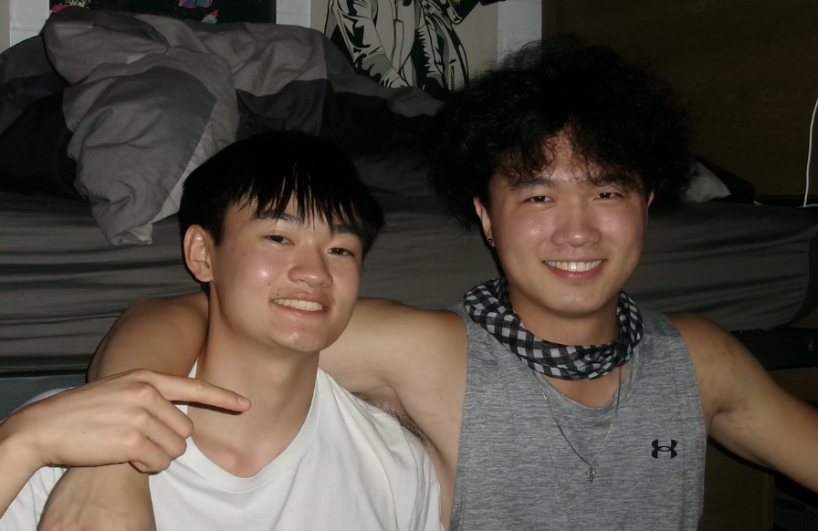

  <a href="/">
    

      
      

      

        H
        E
        L
        L
        O
      

      
↓ scroll to see what I've been working on ↓

    

  </a>

  

    F
    E
    A
    T
    U
    R
    E
    D
  

  

    <!-- Left project (visible but smaller) -->
    

      
    

    
    <!-- Center project (featured with link) -->
    

      
    

    
    <!-- Right project (visible but smaller) -->
    

      
    

  

  

    F
    E
    A
    T
    U
    R
    E
    D
  

  

    
    
    
    
    
    
  

  <a href="/projects/" class="button">Projects</a>

  

    
  

  

    

      
I'm a Computer Engineering student at Northwestern, always diving into projects that mix hardware, software, and creativity. I’ve worked on everything from building robotic systems to designing interactive MIDI controllers. I’m also excited about turning my tech ideas into real products, and when I’m not doing that, you’ll find me involved in a cappella and exploring music production.

    

  

  

    

      <a href="/about/" class="button">About</a>
    

  

  <a href="/gallery/">
    

      
      

      

        
"Design is not just what it looks like and feels like. Design is how it works."

        
— Steve Jobs

      

    

  </a>

  <a href="/contact/" class="button">Contact</a>

designed and coded by Brady Lin in his dormitory
